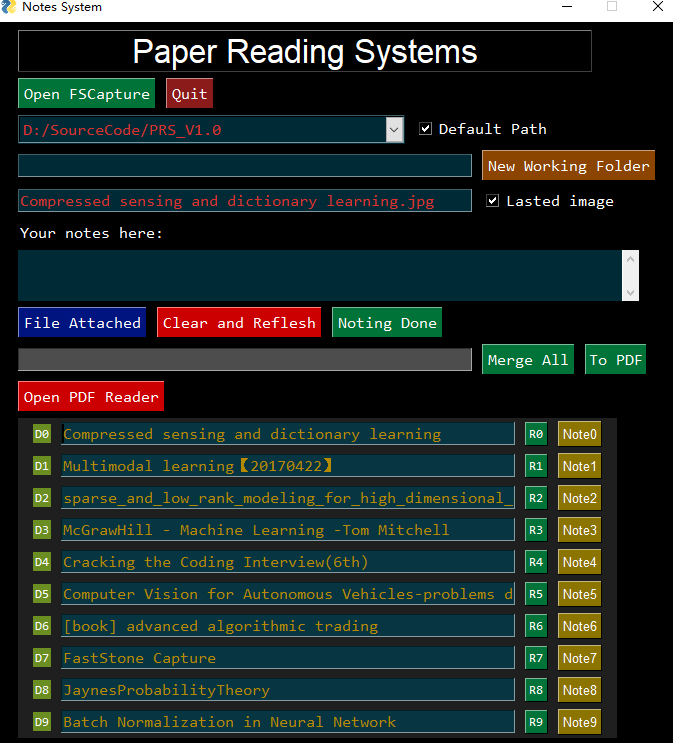

# Basic
There are two examples, example_1.py and example_2.py
# Paper Reading System

##Functions
1. open FSCapture software and Foxit Reader
2. record the reading history
3. add notes to screenshot images
4. merge all jpg notes to a single file
5. convert notes to PDF file
6. check out notes
